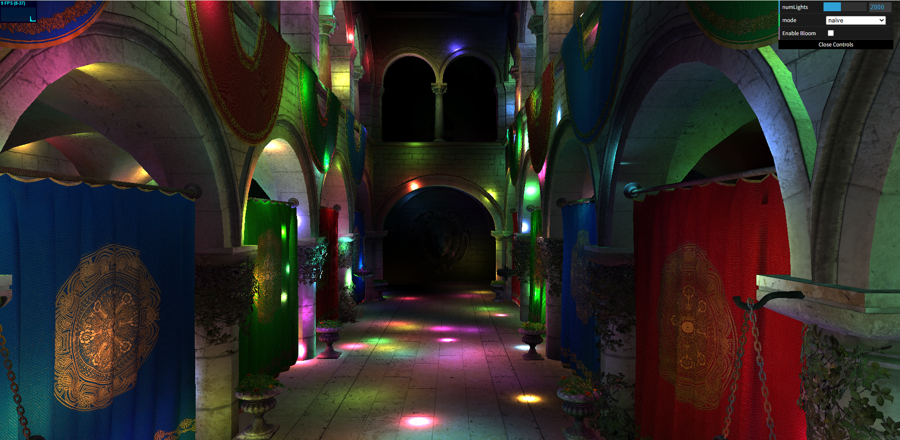
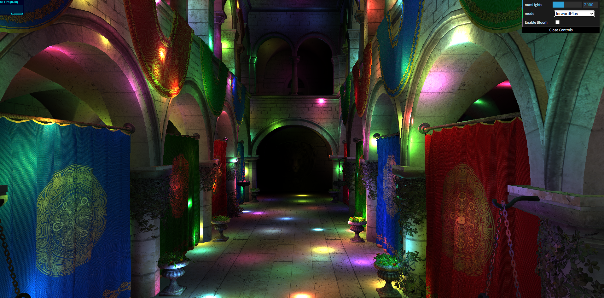
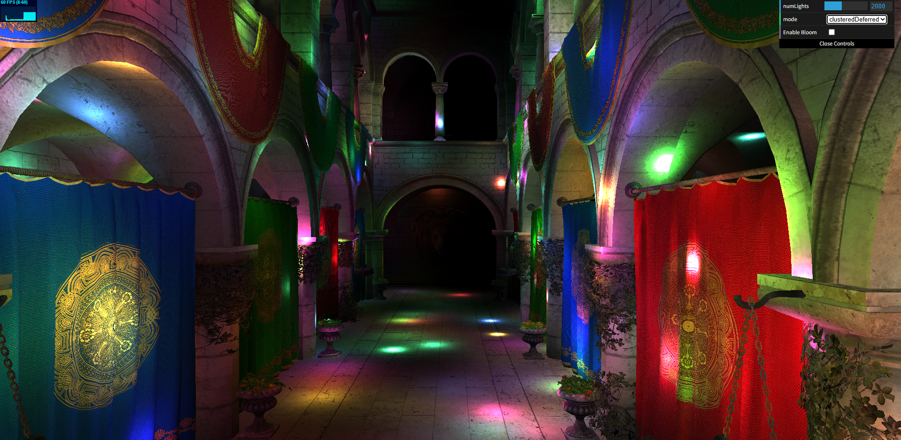
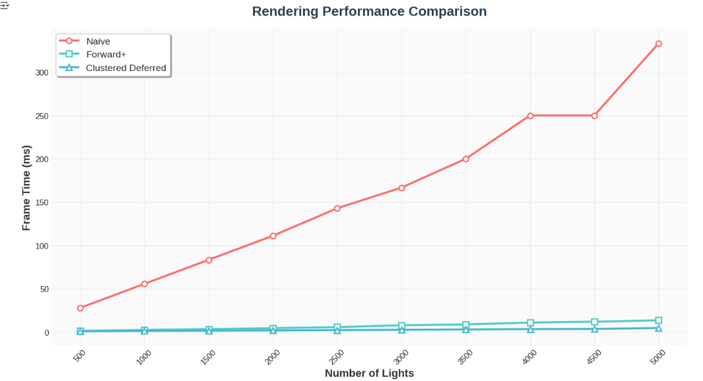
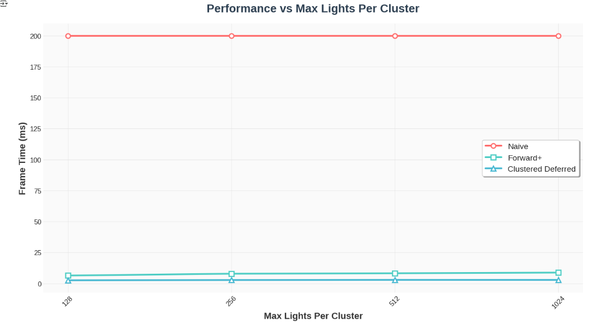
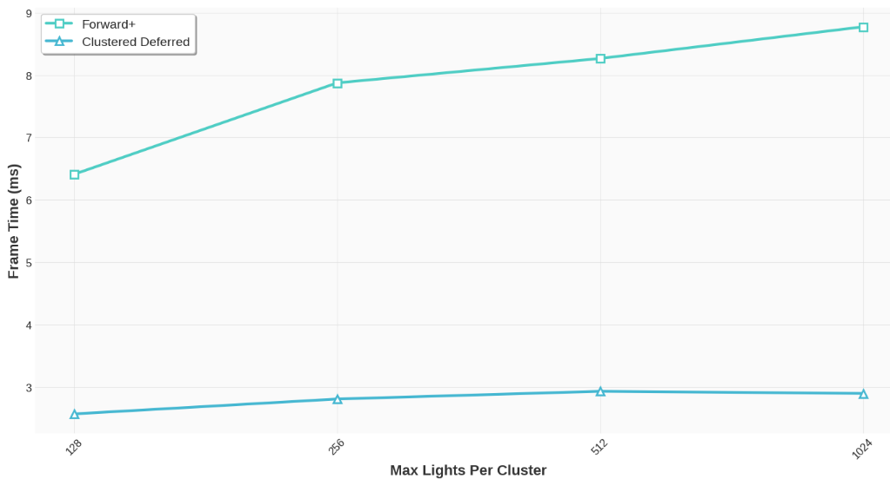
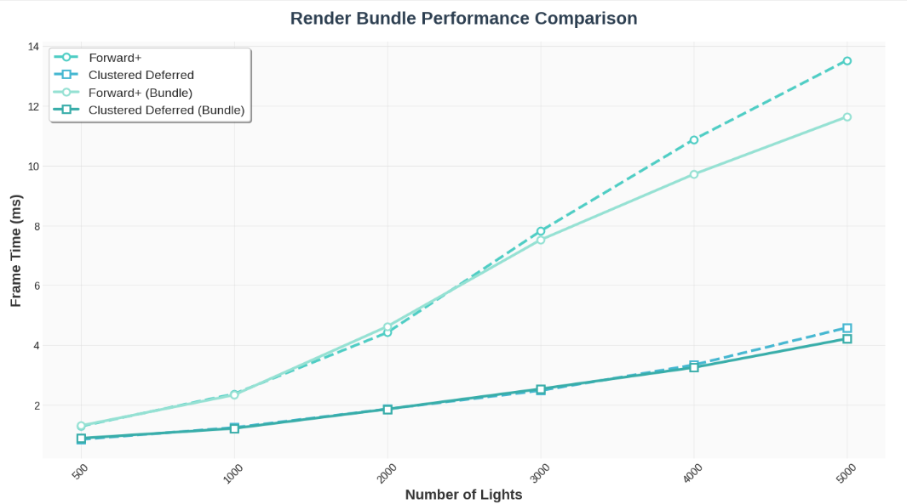
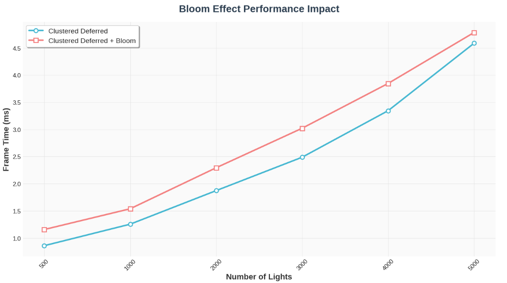

WebGL Forward+ and Clustered Deferred Shading
======================

**University of Pennsylvania, CIS 565: GPU Programming and Architecture, Project 4**

- Muqiao Lei
  
  [LinkedIn](https://www.linkedin.com/in/muqiao-lei-633304242/) · [GitHub](https://github.com/rmurdock41)

- Tested on: Google Chrome Canary 143.0.7473.0
  
   Windows 10, 11th Gen Intel(R) Core(TM) i7-11800H @ 2.30GHz 2.30 GHz, NVIDIA GeForce RTX 3060 Laptop GPU (Personal Computer)

### Live Demo

https://rmurdock41.github.io/Project4-WebGPU-Forward-Plus-and-Clustered-Deferred/

### Demo Video/GIF

Camera control

## Performance Analysis

All performance measurements were conducted at **1920×1080 resolution** using the Sponza Atrium scene. Frame times are reported in **milliseconds (ms)** - lower is better. **Test Configuration:** - Scene: Sponza Atrium (279 meshes, ~262k triangles) - Resolution: 1920×1080 - GPU: NVIDIA GeForce RTX 3060 Laptop - Browser: Chrome Canary 143.0.7473.0

**Test Configuration:** 

- Scene: Sponza Atrium 

- Resolution: 1920×1080 

- GPU: NVIDIA GeForce RTX 3060 Laptop 

- Browser: Chrome Canary 143.0.7473.0

## Naive Forward Renderer

The Naive Forward Renderer serves as the baseline implementation for multi-light rendering in this project, providing a performance benchmark for subsequent optimization methods. This renderer employs the most straightforward forward rendering approach: for each screen pixel, it iterates through all lights in the scene and accumulates their lighting contributions. Following the standard graphics pipeline, the fragment shader processes the complete light list for every fragment, regardless of the light's distance or actual contribution to that fragment, resulting in significant computational redundancy.

The algorithm exhibits O(fragments × lights) complexity, meaning rendering time scales linearly with the number of lights. The performance bottleneck stems from two primary factors: computational redundancy, where lights with limited influence ranges are still evaluated for every fragment, and memory access patterns, where each fragment must read the entire light buffer. When dealing with large numbers of lights, this creates substantial memory bandwidth pressure that becomes the dominant performance constraint.

This renderer is suitable for simple scenes with limited light counts but impractical for modern rendering scenarios requiring numerous dynamic lights. Its primary value lies in establishing a performance baseline and demonstrating why spatial acceleration structures and intelligent light culling strategies are necessary, providing an important reference point for the subsequent Forward+ and Clustered Deferred implementations.

## Forward+ Renderer

Forward+ Renderer represents a significant improvement over the Naive Forward Renderer by introducing light clustering techniques that substantially reduce the number of lights each fragment must process. The core concept involves partitioning the view frustum into a three-dimensional grid and pre-computing which lights potentially affect each grid cell (cluster). During fragment shading, only the lights within the fragment's cluster are evaluated, reducing algorithmic complexity from O(fragments × lights) to O(fragments × average_lights_per_cluster).

The implementation consists of two main phases. The first is the light clustering phase, executed via a compute shader at the beginning of each frame. The view frustum is divided into a configurable 3D grid (16×9×24 in this implementation), where each cluster corresponds to a tile in screen space and a depth slice. The compute shader calculates an axis-aligned bounding box (AABB) for each cluster in view space, then iterates through all lights to determine intersection via sphere-AABB testing. If a light intersects with a cluster's bounds, its index is stored in that cluster's light list. The depth dimension uses exponential rather than linear subdivision, providing higher precision near the camera to better match perspective projection characteristics.

The rendering phase's fragment shader first determines which cluster contains the current fragment based on its screen coordinates and depth value. Screen coordinates directly map to XY indices, while depth is mapped to the Z index through a logarithmic function. Once the cluster index is obtained, the fragment shader only iterates through that cluster's light list rather than all scene lights. This list typically contains only a few dozen lights at most, compared to potentially thousands in the naive approach, dramatically reducing computational load.

The primary advantage of this method is more graceful performance scaling as light counts increase. In scenes with relatively uniform light distribution, each cluster contains only a small subset of lights on average, making rendering performance dependent more on scene complexity than total light count. However, the method has some limitations: it requires an additional compute pass for clustering that adds overhead, densely packed lights in certain regions can cause some clusters to contain many lights leading to performance degradation, and cluster count configuration requires balancing precision against memory usage, as too few clusters result in imprecise light assignment while too many increase memory overhead and clustering computation time.

## Clustered Deferred Renderer

Clustered Deferred Renderer combines the light clustering concept from Forward+ with deferred rendering techniques, further decoupling geometry processing from lighting computation. The core approach divides rendering into two independent stages: the first stage writes scene geometry information into a G-buffer, and the second stage performs lighting calculations via a fullscreen quad that reads from the G-buffer. This separation ensures that lighting complexity is no longer directly dependent on scene geometry complexity, making it particularly suitable for scenes with complex materials and significant geometry overlap.

The first stage is G-buffer generation. The rendering pipeline iterates through all geometry in the scene, with the fragment shader writing each visible fragment's world-space position, normal, and albedo into three separate rgba16float textures. This stage performs geometry processing only once without any lighting calculations. The rgba16float format ensures sufficient precision for storing position and normal information, avoiding visual artifacts from precision loss. The fragment shader in this stage is relatively simple, only requiring texture sampling and geometry attribute output without any light loops or complex computations.

The second stage is fullscreen lighting computation. Using a screen-covering triangle generated by the vertex shader (requiring no actual vertex buffer), the fragment shader reads position, normal, and albedo information from the three G-buffer textures for each screen pixel. It then employs the same clustering logic as Forward+: calculating XY cluster indices from screen coordinates and computing the Z cluster index through a logarithmic function based on reconstructed view-space depth to determine which cluster the pixel belongs to. After obtaining the cluster index, the fragment shader iterates through that cluster's light list, calculates each light's contribution, accumulates them, and outputs the final result to the canvas.

The primary advantage over Forward+ lies in the complete decoupling of geometry and lighting. In Forward+, each geometric primitive must execute full lighting calculations, and if the scene contains significant overlapping geometry (such as complex interior scenes), many fragments are shaded multiple times, wasting computation on overdraw. Clustered Deferred performs lighting calculations only once for each finally visible pixel, completely eliminating the performance impact of overdraw on lighting. 

However, deferred rendering also introduces some costs. First is increased memory bandwidth: three G-buffer textures must be written and then read during the lighting stage, totaling six texture accesses. At 1920×1080 resolution, three rgba16float textures occupy approximately 48MB of VRAM, increasing memory pressure. Second is reduced flexibility: since the G-buffer can only store limited material information, it struggles with transparent objects or complex shading requiring multiple material models. Finally, in scenes with sparse lighting or simple geometry with minimal overdraw, deferred rendering's advantages are less pronounced, and it may even be slightly slower than Forward+ due to additional texture read/write operations.

## Performance Comparison: Light Count Analysis

| Light Count | Naive (ms) | Forward+ (ms) | Deferred (ms) |
| ----------- | ---------- | ------------- | ------------- |
| 500         | 27.78      | 1.30          | 0.86          |
| 1000        | 55.56      | 2.38          | 1.25          |
| 1500        | 83.33      | 3.32          | 1.56          |
| 2000        | 111.11     | 4.42          | 1.87          |
| 2500        | 142.86     | 5.62          | 2.16          |
| 3000        | 166.67     | 7.81          | 2.49          |
| 3500        | 200.00     | 8.77          | 2.90          |
| 4000        | 250.00     | 10.87         | 3.34          |
| 4500        | 250.00     | 11.90         | 3.60          |
| 5000        | 333.33     | 13.51         | 4.59          |

**The Naive Renderer**  performs worst, requiring 27.78ms at 500 lights, far exceeding the 16.67ms threshold for real-time rendering at 60 FPS. As lights increase to 5000, frame time reaches an unusable 333.33ms. The Naive renderer exhibits a clear linear relationship between frame time and light count - doubling from 500 to 1000 lights nearly doubles frame time (27.78ms → 55.56ms), confirming O(n×m) complexity. 

**Forward+ Renderer** shows dramatic performance improvement. At 500 lights, it requires only 1.30ms, 21 times faster than Naive. Even in the extreme case of 5000 lights, it maintains near 60 FPS performance at 13.51ms. Forward+'s frame time growth rate is significantly lower than Naive - a 10-fold increase in lights (500 to 5000) results in only approximately 10-fold frame time increase (1.30ms → 13.51ms), demonstrating excellent scalability. 

**Clustered Deferred Renderer** performs best across all test scenarios. At 500 lights it requires only 0.86ms, 33% faster than Forward+. Its advantage is most pronounced at moderate light counts (2000-3000), maintaining frame times between 2-3ms. However, at 5000 lights, frame time increases to 4.59ms, showing slightly faster growth than Forward+.

The performance gap between the three renderers stems primarily from their different light processing strategies. The Naive Renderer's performance degrades linearly with light count because each fragment must iterate through all lights, causing massive redundant computation and repeated memory access. Even at the relatively light load of 500 lights, repeated reads from the light buffer create severe memory bandwidth bottlenecks, with GPU compute units spending most time waiting for data rather than performing actual calculations. As light count increases, this problem deteriorates exponentially, making this approach completely impractical for real applications.

Forward+ dramatically reduces the number of lights each fragment must process through light clustering, shifting the bottleneck from global light iteration to per-cluster light processing. The key to its performance improvement lies in spatial locality: most fragments are only affected by a few lights within their cluster, avoiding over 95% of the useless computation in the Naive approach. However, as light count increases, some clusters contain more lights, causing gradual performance degradation. Clustered Deferred performs best at low to moderate light counts because it completely eliminates the impact of geometry overdraw on lighting calculations, but at high light counts, G-buffer read/write overhead becomes the primary bottleneck. Writing and reading three rgba16float textures creates significant memory bandwidth pressure at high resolutions, explaining why at 5000 lights, although Deferred remains fastest, its advantage diminishes compared to lower light counts.

## Max Lights Per Cluster Analysis

| Max Lights Per Cluster | Naive (ms) | Forward+ (ms) | Deferred (ms) |
| ---------------------- | ---------- | ------------- | ------------- |
| 128                    | 200.00     | 6.41          | 2.57          |
| 256                    | 200.00     | 7.87          | 2.81          |
| 512                    | 200.00     | 8.26          | 2.93          |
| 1024                   | 200.00     | 8.77          | 2.90          |

The data shows that the maxLightsPerCluster parameter has no impact on the Naive Renderer as it does not use any clustering mechanism. For Forward+ and Clustered Deferred, the parameter's effect is relatively modest. Forward+'s frame time shows approximately 37% degradation when increasing from 128 to 1024 (6.41ms → 8.77ms), while Clustered Deferred remains nearly constant between 2.57-2.93ms. This indicates that at higher parameter settings, the actual number of lights per cluster is far below the set limit, with most clusters not reaching their storage capacity.

The performance variation primarily reflects differences in memory access patterns. Increasing maxLightsPerCluster enlarges the cluster data structure size, and even when clusters actually contain only a few lights, the GPU must still allocate larger memory space for each cluster. This leads to slight increases in cache misses and memory bandwidth waste. Forward+ is more noticeably affected because it directly accesses cluster data in the fragment shader, while Clustered Deferred benefits from better locality in cluster data access due to its separation of geometry and lighting. Notably, Deferred shows a slight performance recovery at 1024 (2.90ms), possibly due to compiler optimizations or GPU cache alignment effects.

However, this parameter's selection affects not only performance but also rendering quality directly. When maxLightsPerCluster is set to 128, rendering quality shows significant problems, with clusters in dense light regions being forced to truncate their light lists due to capacity limits, causing many light contributions to be ignored. Visually, this manifests as severe lighting discontinuities and blocky artifacts, particularly at cluster boundaries where lighting abruptly cuts off, creating obvious tiling effects. Settings of 256 and above significantly improve visual quality, but in extreme dense-light scenarios, 512 or 1024 are necessary to completely avoid truncation issues. Therefore, in practical applications, this parameter must be carefully chosen based on the scene's maximum light density, and larger values should be used whenever the performance overhead is acceptable to ensure rendering quality.

## Render Bundle Implementation

Render bundles are a WebGPU optimization technique that pre-records rendering commands for static geometry, reducing CPU overhead by avoiding redundant command encoding every frame. The implementation creates a render bundle during initialization that captures all draw calls for the scene geometry. In the `createRenderBundle` method, a `GPURenderBundleEncoder` records the rendering pipeline, bind groups, vertex/index buffers, and draw commands for each mesh in the scene. This bundle is created once during construction and reused every frame via `executeBundles()`. When render bundles are disabled, the renderer falls back to traditional command recording, encoding all draw calls directly into the render pass each frame. This comparison allows measuring the CPU-side overhead reduction provided by render bundles.

| Light Count | Forward+ (ms) | Forward+ Bundle (ms) | Deferred (ms) | Deferred Bundle (ms) |
| ----------- | ------------- | -------------------- | ------------- | -------------------- |
| 500         | 1.30          | 1.32                 | 0.86          | 0.90                 |
| 1000        | 2.38          | 2.34                 | 1.25          | 1.23                 |
| 2000        | 4.42          | 4.63                 | 1.87          | 1.87                 |
| 3000        | 7.81          | 7.52                 | 2.49          | 2.54                 |
| 4000        | 10.87         | 9.71                 | 3.34          | 3.26                 |
| 5000        | 13.51         | 11.63                | 4.59          | 4.22                 |

The data reveals that render bundle's performance impact is subtle and inconsistent. At low light counts (500-1000), using render bundles provides virtually no performance benefit, with Forward+ even showing slight degradation (1.30ms → 1.32ms) and Clustered Deferred similarly affected (0.86ms → 0.90ms). However, as light count increases to 4000-5000, performance differences become apparent, with Forward+ improving from 13.51ms to 11.63ms using bundles (approximately 14% improvement), and Clustered Deferred improving from 4.59ms to 4.22ms (approximately 8% improvement). This trend indicates that render bundle advantages primarily manifest in high-load scenarios, where reducing CPU-side command encoding overhead produces measurable impact when both GPU and CPU are under significant pressure.

The inconsistent performance gains reflect the complexity of WebGPU rendering. In light-load scenarios, GPU processing is fast and frame time is primarily determined by GPU execution time, making CPU-side command encoding overhead relatively negligible, thus render bundle's pre-recording advantages cannot manifest. As light count increases and GPU workload grows, frame time lengthens, allowing the CPU more time for command encoding, making the difference between the two methods apparent. Overall, render bundles are an optimization technique suited for static geometry and high GPU load scenarios, with effectiveness depending on specific workload characteristics, providing 8-14% performance improvement in this test scene.

## Compute Shader Fullscreen Pass Implementation

In the standard Clustered Deferred implementation, fullscreen lighting computation uses the traditional vertex + fragment shader pipeline: the vertex shader generates a screen-covering triangle, and the fragment shader reads from the G-buffer and performs lighting calculations for each pixel. As an additional implementation, this project replaces the fullscreen pass with a compute shader. The compute shader directly processes screen pixels with an 8×8 workgroup size, using `@builtin(global_invocation_id)` to determine which pixel coordinate each thread handles, reads geometry information from G-buffer textures, executes the same clustered lighting calculations as the fragment shader, and finally writes results to a storage texture via `textureStore()`.

This implementation requires an **additional blit pass** because WebGPU's canvas format (bgra8unorm) does not support storage texture usage. Therefore, the compute shader first writes to an intermediate rgba8unorm texture, then copies the result to the canvas through a simple fullscreen render pass. The advantage of this architecture lies in the compute shader's more flexible execution model and easier integration of multi-pass post-processing, laying the foundation for implementing effects like Bloom.

The performance difference between the two is typical small (within 1-2%). In testing, the compute shader version is slightly slower by approximately 2-3%, mainly attributed to the additional blit pass overhead requiring a complete render pass for format conversion. However, this difference is so minimal that results are inconsistent across multiple tests, sometimes even reversing.

Furthermore, the primary purpose of implementing the compute shader version is not performance optimization, but rather to provide a more flexible architecture for subsequent post-processing effects such as Bloom. Compute shaders allow easier chaining of multiple compute passes and sharing of intermediate results, making complex post-processing pipelines more intuitive to implement. Therefore, this implementation is more of an architectural choice than a performance optimization, with its value lying in code extensibility and flexibility.

## Bloom Post-Processing Implementation

Bloom is an HDR post-processing effect that enhances the glow of bright areas in the image by simulating light scattering in camera lenses. The implementation uses a classic multi-pass approach, entirely executed using compute shaders. The first pass is the bright pass, which extracts pixels exceeding a brightness threshold (threshold = 1.0) by calculating perceptual luminance through a weighted sum of RGB components (0.2126, 0.7152, 0.0722). Only pixels with luminance above the threshold are preserved, while others output black.

The second and third passes implement separable box blur. Horizontal blur applies a box filter with radius 4 in the horizontal direction, sampling 9 adjacent pixels for each pixel and computing their average. Vertical blur performs the same operation in the vertical direction. Using a separable filter decomposes the 2D blur into two 1D operations, reducing computational complexity from O(r²) to O(r), where r is the blur radius. While box blur quality is inferior to Gaussian blur, its computational efficiency makes it a common trade-off in real-time rendering.

The final composite pass blends the blurred bright regions with the original image. The original image and blurred result are combined through simple addition, with the blurred portion multiplied by a 0.5 weight to control bloom intensity. All four passes use an 8×8 workgroup size, maintaining a uniform execution pattern. The entire bloom effect is completed entirely in GPU-side compute shaders without involving CPU-GPU data transfer.

### Performance Analysis

| Light Count | Deferred (ms) | Bloom (ms) | Overhead (ms) |
| ----------- | ------------- | ---------- | ------------- |
| 500         | 0.86          | 1.16       | 0.30          |
| 1000        | 1.25          | 1.54       | 0.29          |
| 2000        | 1.87          | 2.29       | 0.42          |
| 3000        | 2.49          | 3.02       | 0.53          |
| 4000        | 3.34          | 3.85       | 0.51          |
| 5000        | 4.59          | 4.78       | 0.19          |

The Bloom effect adds approximately 0.2-0.5ms of fixed overhead, relatively independent of light count. In low-light scenarios (500-1000), Bloom adds about 0.3ms, accounting for 25-35% of total frame time. As light count increases to 2000-4000, overhead grows to 0.4-0.5ms, but its proportion drops to 15-22%. Interestingly, in the extreme case of 5000 lights, overhead actually decreases to 0.19ms, possibly due to GPU scheduling optimizations under high load or parallel execution effects between multiple compute passes.

Bloom's overhead primarily stems from texture access rather than computation. The bright pass requires reading the original rendering result, two blur passes read and write intermediate textures respectively, and the composite pass reads two textures. At 1920×1080 resolution, each pass processes approximately 2 million pixels, with four passes totaling about 9 full-resolution texture read/write operations. While the box blur loop is simple, each pixel requires sampling 9 adjacent pixels, resulting in substantial texture reads. At high resolutions, memory bandwidth becomes the primary bottleneck. The relatively stable overhead indicates that Bloom is a bandwidth-limited rather than compute-limited operation, with performance primarily dependent on resolution rather than scene complexity, which also explains why overhead remains relatively consistent across different light counts.

### Credits

- [Vite](https://vitejs.dev/)
- [loaders.gl](https://loaders.gl/)
- [dat.GUI](https://github.com/dataarts/dat.gui)
- [stats.js](https://github.com/mrdoob/stats.js)
- [wgpu-matrix](https://github.com/greggman/wgpu-matrix)
